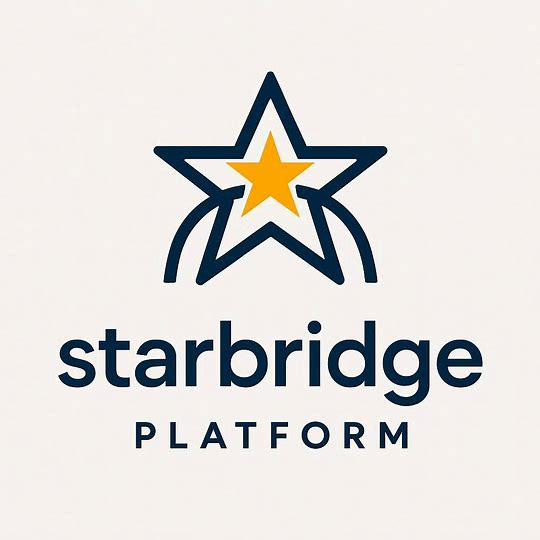

<div align="center">
  
  
  # **Starbridge Platform**

  > *"Seamlessly connecting workflows across the digital frontier"* 🖖
</div>

---

## 🎯 What is the Starbridge Platform?

**Starbridge Platform** is a comprehensive Kubernetes service architecture, designed to transform your infrastructure into an enterprise-grade workflow orchestration system. Built specifically for **Workflow Nexus (n8n)**, **Data Vault (PostgreSQL)**, **Neural Nexus (AI models)**, **Guardian Nexus (security)**, and **secure File Bridge services**.

### **🚀 Service Architecture**

- **🌉 File Bridge** - Transform local directories into secure SFTP endpoints
- **🤖 Workflow Nexus** - Complete n8n automation with dual-mode deployment  
- **🐘 Data Vault** - Cross-namespace PostgreSQL database services
- **🧠 Neural Nexus** - Ollama-powered AI model deployment with GPU support
- **�️ Guardian Nexus** - Keycloak OIDC security and role-based access control
- **📡 Starbridge Beacon** - Web interface and service monitoring
- **⚙️ Cross-Namespace Operations** - Enterprise-scale service isolation

---

## 🛠️ Quick Start

### **Prerequisites**
- Kubernetes cluster (Rancher Desktop as example for local development)
- `kubectl` configured
- `make` installed

### **Deploy Your First File Bridge**
```bash
# Create a local file bridge
make new-local-file-bridge BRIDGE_NAME=input BRIDGE_PATH=/home/user/data

# Deploy SSH keys to n8n
make n8n-deploy-ssh-keys BRIDGE_NAME=input

# Get credentials for n8n
make n8n-get-private-key BRIDGE_NAME=input
```

### **Deploy Complete Platform**
```bash
# Deploy PostgreSQL database
make deploy-postgres

# Deploy n8n workflows
make deploy-n8n

# Deploy AI models
make new-ollama-pod MODEL=llama3.1
```

---

## 📋 Platform Components

| Component | Purpose | Status |
|-----------|---------|--------|
| **File Bridges** | Secure SFTP file access | ✅ Production Ready |
| **n8n Integration** | Workflow automation | ✅ Production Ready |
| **PostgreSQL** | Database services | ✅ Production Ready |
| **Ollama AI** | LLM model deployment | ✅ Production Ready |
| **SSH Management** | Security automation | ✅ Production Ready |

---

## 🎮 Management Commands

### **📁 File Bridge Operations**
```bash
make list-file-bridges                    # List all bridges
make new-file-bridge BRIDGE_NAME=remote   # Create remote bridge
make test-file-bridge BRIDGE_NAME=input   # Test connectivity
```

### **🤖 n8n Operations**
```bash
make deploy-n8n                          # Deploy n8n platform
make n8n-list-ssh-keys                    # List SSH credentials
make port-forward                         # Access n8n UI
```

### **🧠 AI Model Operations**
```bash
make show-model-catalog                   # Available models
make new-ollama-pod MODEL=llava          # Deploy vision model
make list-ollama-pods                     # List deployments
```

---

## 🔗 Integration Example: n8n + File Bridge

### **1. Deploy File Bridge**
```bash
make new-local-file-bridge BRIDGE_NAME=workflows BRIDGE_PATH=/data/n8n
```

### **2. Configure n8n SFTP Node**
```json
{
  "host": "file-bridge-workflows.file-bridges.svc.cluster.local",
  "port": 2201,
  "username": "bridge-user",
  "authentication": "privateKey",
  "privateKey": "{{$credentials.workflows-ssh-key}}"
}
```

### **3. Access Files in Workflows**
Your n8n workflows can now securely read/write files through the SFTP bridge!

---

## 🏗️ Architecture

```
┌─────────────────┐    ┌─────────────────┐    ┌─────────────────┐
│   n8n Workflows │────│  File Bridges   │────│   Local Files   │
│   (n8n-prod)    │    │ (file-bridges)  │    │  (/your/data)   │
└─────────────────┘    └─────────────────┘    └─────────────────┘
         │                       │                       │
         └───────────────────────┼───────────────────────┘
                                 │
                    ┌─────────────────┐
                    │   PostgreSQL    │
                    │   (database)    │
                    └─────────────────┘
```

---

## 🌟 Why "Starbridge"?

- **Star** - Reaches for the stars in automation excellence
- **Bridge** - Connects disparate systems seamlessly
- **Platform** - Foundation for enterprise workflows
- **🖖 Star Trek Inspiration** - Built for exploration and discovery

---

## 📚 Documentation

- **[File Bridge Module](file_bridge_deployment/README.md)** - Complete file bridge documentation (WIP)
- **[n8n Deployment](n8n_deployment/README.md)** - n8n setup and configuration (WIP)
- **[Ollama AI](ollama_deployment/README.md)** - AI model deployment guide (WIP)

---

## 🖖 About the Star Trek Inspiration

The Starbridge Platform draws inspiration from **Star Trek's** vision of exploration, cooperation, and technological advancement. The naming conventions (Nexus, Bridge, Beacon, Guardian) reflect the series' optimistic view of technology as a tool for connection and progress rather than conflict.

- **"Starbridge"** represents the connections we build across digital systems
- **Service names** are inspired by Star Trek's collaborative technology concepts
- **🖖 "Live long and prosper"** embodies our commitment to sustainable, long-term platform solutions

This is a tribute to Star Trek's inspiring vision of the future, not a military simulation.

---

## 🤝 Contributing

Built with love for the DevOps community. Contributions welcome!

**Live long and prosper!** 🖖

---

## 📄 License

This project is licensed under the **MIT License** - see the [LICENSE](LICENSE) file for details.

### What this means for you:
- ✅ **Free to use** for personal and commercial projects
- ✅ **Modify and distribute** as needed
- ✅ **No royalties or fees** required
- ✅ **Enterprise-friendly** licensing

The only requirement is to **include the original copyright notice** when redistributing.

---

*Starbridge Platform - Where enterprise meets automation*